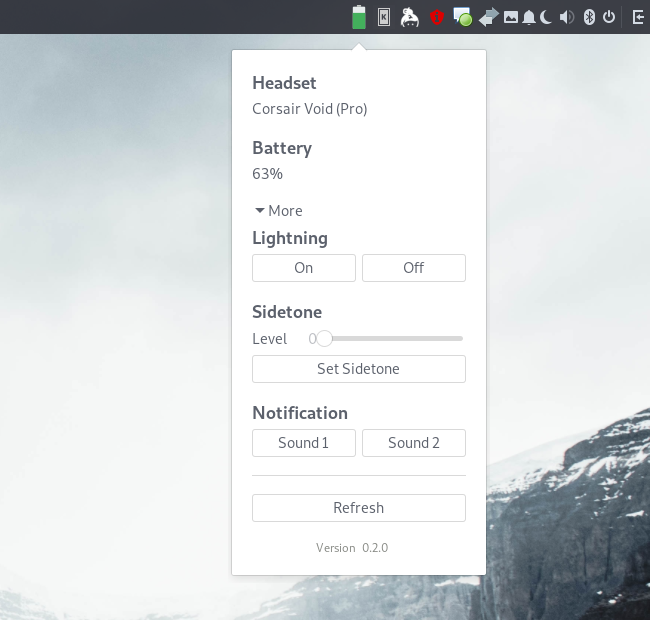

# Budgie Headset Control Applet

Please see [Sapd/HeadsetControl](https://github.com/Sapd/HeadsetControl) for supported headsets.

  
See [docs](docs/) for more screenshots!

### Installation
1. Install [Sapd/HeadsetControl](https://github.com/Sapd/HeadsetControl).

2. Download, configure, build and install.
```terminal
git clone https://github.com/olback/budgie-headset-control-applet.git
cd budgie-headset-control-applet
make configure
make build
sudo make install
```

Don't forget to logout or restart.

### Uninstall
```terminal
sudo make uninstall
```

### Development
Logging out and in every time you want to test during development is not fun, to avoid this you can run `budgie-panel --replace &`. Keep in mind that when you close your terminal after running this, budgie will exit and you will have to restart.

Icons from [freeicons.io](https://freeicons.io/).  

Reading the source of [cybre/budgie-screenshot-applet](https://github.com/cybre/budgie-screenshot-applet) helped me alot during development. Please check it out :)
